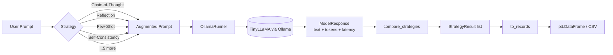

# prompt-strategy-lab

9 prompt-engineering strategies you can swap in and out, plus a harness that runs all of them against the same prompt on a local LLM (Ollama) so you can actually see what each one does differently.

Includes a [walkthrough notebook](notebooks/walkthrough.ipynb) that applies these strategies across five SDLC phases — from problem ideation to solution development — with full model outputs.


## Why I built this

I wanted to see how different prompt strategies actually compare when you hold everything else constant: same model, same prompt, same parameters. Most blog posts about prompt engineering show one technique in isolation. This runs them all side-by-side and gives you the numbers.

Every strategy shares the same `Strategy.augment(user_prompt)` interface, so they're easy to plug into other projects. The harness returns `StrategyResult` objects with the response text, token count, and latency, and `to_records()` flattens those into dicts you can throw straight into a DataFrame.

## Tech stack

| | |
|---|---|
| **Inference** | [Ollama](https://ollama.com/) with [TinyLLaMA](https://ollama.com/library/tinyllama) (any Ollama chat model works) |
| **Language** | Python 3.10+ |
| **Data** | [pandas](https://pandas.pydata.org/) |
| **Tests** | [pytest](https://docs.pytest.org/) (all deterministic, no LLM calls) |

## Architecture



## Quickstart

```bash
# Install Ollama and pull a model
ollama pull tinyllama

# Set up the Python environment
python -m venv .venv
source .venv/Scripts/activate   # Windows: .venv\Scripts\activate
pip install -e .[dev]

# Run the tests (no LLM needed)
pytest

# Open the demo notebook
jupyter lab notebooks/demo.ipynb
```

## Library usage

```python
from prompt_strategy_lab import (
    compare_strategies,
    to_records,
    OllamaRunner,
    STRATEGIES,
)
import pandas as pd

print(sorted(STRATEGIES.keys()))
# ['alternative_approaches', 'chain_of_thought', 'comparative',
#  'cot_with_reflection', 'fact_check_list', 'few_shot',
#  'reflection', 'self_consistency', 'template']

runner = OllamaRunner(model="tinyllama")
results = compare_strategies(
    user_prompt="Propose a backend code structure for an AI-powered exam studying app.",
    strategy_names=["few_shot", "chain_of_thought", "cot_with_reflection", "self_consistency"],
    runner=runner,
    temperature=0.7,
    num_predict=600,
)

for r in results:
    print(f"--- {r.strategy} ({r.latency_ms:.0f} ms, {r.tokens_used} tok) ---")
    print(r.response[:200], "...")

df = pd.DataFrame(to_records(results))
df.to_csv("results/comparison.csv", index=False)
```

## Sample output

> Run from `comparison_20260425_164951.csv` — prompt: *"Propose a backend code structure for an AI-powered exam studying app for SAT, GRE, and Medical Exams."*, four strategies, TinyLLaMA 1.1B, `temperature=0.7`, `num_predict=600`.

| Strategy | Latency (ms) | Tokens | What happened |
|---|---:|---:|---|
| `few_shot` | 22,436 | 326 | Produced a concrete folder tree with per-file purpose annotations, closest to a usable answer |
| `chain_of_thought` | 8,000 | 597 | Generated detailed stakeholder analysis but drifted away from actual code structure |
| `cot_with_reflection` | 3,586 | 249 | Echoed the system prompt back verbatim — model lacked capacity for multi-step meta-instructions |
| `self_consistency` | 8,243 | 600 | Burned the entire token budget printing its internal scoring rubric instead of a final design |

The demo notebook has the full outputs and a pandas DataFrame you can explore interactively.

## Walkthrough notebook

The [`walkthrough.ipynb`](notebooks/walkthrough.ipynb) notebook goes beyond the side-by-side comparison and applies prompt strategies across five SDLC phases, each with a dedicated experiment:

| # | Experiment | SDLC Phase | Techniques Used | Key Observation |
|---|---|---|---|---|
| 1 | Problem Ideation | Discovery | Chain-of-Thought | Produced 4 structured problem statements with pain points, assumptions, and clarifying questions (645 tokens) |
| 2 | Solution Ideation | Discovery | Chain-of-Thought | Generated 2 solution concepts with features, risks, and metrics — but hallucinated exam acronyms (405 tokens) |
| 3 | Requirement Analysis | Requirements | Template (User Stories) | Output followed the Given/When/Then acceptance criteria format as instructed |
| 4 | System Design | Design | Few-Shot, CoT+Reflection, Self-Consistency | Few-Shot produced a concrete folder tree; CoT+Reflection echoed instructions; Self-Consistency printed its rubric |
| 5 | Solution Development | Implementation | Few-Shot, CoT+Reflection, Self-Consistency (×5 candidates) | Few-Shot again produced the most usable output; a `run_self_consistent()` helper scored candidates by section-header coverage |

The walkthrough also includes a reusable `model_request()` function with configurable parameters (`temperature`, `top_k`, `top_p`, `num_predict`, `context_window`) and documents the parameter tuning choices for each experiment.

> **Consistent finding across all 5 experiments:** Few-Shot prompting was the most reliable strategy for structured output on TinyLLaMA. Strategies that require multi-step meta-reasoning (CoT+Reflection, Self-Consistency) consistently failed — the 1.1B-parameter model doesn't have enough capacity to follow complex instructions *and* produce a real answer.

## Strategies

| Name | Key | What it does |
|---|---|---|
| Chain-of-Thought | `chain_of_thought` | Asks the model to reason step-by-step before answering |
| Reflection | `reflection` | Generates an answer, then critiques its own output |
| Alternative Approaches | `alternative_approaches` | Forces three different perspectives (end-user, operator, admin) |
| Template | `template` | Constrains output to a fixed format (Problem → Metrics) |
| Comparative | `comparative` | Generates 3 approaches, compares tradeoffs, picks one |
| Fact-Check List | `fact_check_list` | Separates verifiable facts from assumptions |
| Few-Shot | `few_shot` | Provides examples of the desired output style |
| CoT + Reflection | `cot_with_reflection` | Two-pass: silent planning, then silent self-review, then final answer |
| Self-Consistency | `self_consistency` | Generates several candidates internally, merges the best parts |

## Public API

| Export | Type | Description |
|---|---|---|
| `compare_strategies()` | function | Runs one prompt through multiple strategies, returns results |
| `to_records()` | function | Converts `StrategyResult` list to plain dicts for DataFrames |
| `OllamaRunner` | class | Wraps the Ollama client, tracks timing and tokens |
| `ModelResponse` | dataclass | `text`, `tokens_used`, `latency_ms`, `model` |
| `STRATEGIES` | dict | Maps strategy keys to `Strategy` instances |
| `Strategy` | class | Base class. Subclass it and set `template` to add your own |

## What I learned

Running all of these on TinyLLaMA (1.1B params) instead of a bigger model turned out to be the interesting part. The small model makes the gaps between strategies obvious in ways that GPT-4 class models would just paper over.

**Few-Shot was the clear winner for structured output** — across all five SDLC experiments in the walkthrough, not just the side-by-side comparison. Giving the model concrete examples to mimic kept it on track every time. Chain-of-Thought generated a lot of text but wandered off-topic. Self-Consistency tripled the latency for marginal quality gains (even with the `run_self_consistent()` N-candidate approach in the walkthrough). And CoT+Reflection, which should have been the best of both worlds, just echoed the instructions back verbatim. The model didn't have enough capacity to follow multi-step meta-instructions while also producing a real answer.

Parameter tuning also mattered more than expected. Lowering `temperature` to 0.35 with `top_k=30` improved format fidelity for Few-Shot, while CoT benefited from a slightly higher `top_p=0.95` to allow longer reasoning chains.

## Project layout

```
prompt-strategy-lab/
├── src/prompt_strategy_lab/
│   ├── __init__.py        # public API re-exports
│   ├── strategies.py      # 9 prompt strategies, each with .augment()
│   ├── runner.py          # OllamaRunner with timing and token tracking
│   └── compare.py         # compare_strategies() + to_records()
├── tests/
│   └── test_strategies.py # deterministic tests, no LLM calls
├── notebooks/
│   ├── demo.ipynb         # end-to-end example with pandas
│   └── walkthrough.ipynb  # 5 SDLC-phase experiments with full outputs
├── results/               # saved CSV outputs from runs
└── pyproject.toml
```
